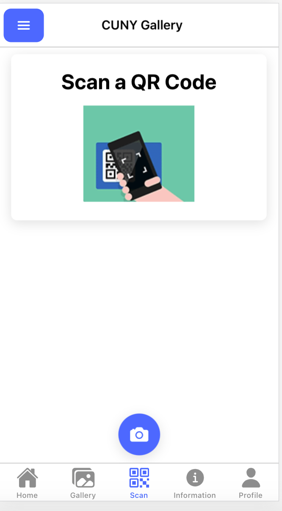

# CUNY-Campus-Art-PWA

## Update - 10/2/2020 - Mary

To run this locally on your machine you will need to have the following installed:
* <a href="https://nodejs.org/en/"> node.js </a> for npm
* ionic - can install using:

> `npm install -g @ionic/cli native-run cordova-res`

After cloning this repo you will need to install all packages needed :

>`npm install`

Then you can run it locally using the following command:
> `ionic serve`

The initial upload of application is based on the tabs template from ionic using:

> `ionic start CUNY-gallery tabs --type=react -capacitor`

I mostly worked in the App.tsx, Information.tsx, and ScanQR.tsx files.
* <strong>App.tsx </strong> : you will find the routes to the tabs associated with the app, including home, gallery, scan, information, and profile, which are subject to change.

* <strong> Information.tsx </strong> : This is the code for the information tab, which will include the information for the artwork. Currently it holds static dummy data, I will be looking into connecting to the API/database to show data.

Update: 10/12/20 - The information tab and gallery tab now holds dynamic data that is pulled from the database.

* <strong>ScanQR.tsx</strong> : This will be the tab where users can scan QR codes. Currently it just holds the text instructing user to scan QR code. Looking into implementing opening of camera in this tab.

Update: 10/12/20 - User is able to use the QR Scanner to scan an art display

## Update 10/12/20 - Jamila - Testing App

React-Redux has now been incorpated into this app to make it easier to manage state. And the app can now scan a qr code and pull information from the database and display it.

Firebase Link for app is:
(To add)

You can test what we have so far with these QR Codes.

## Update 10/19/20 - Mary - Adding UI Components

* Added bootstrap to the application and added more ui components to profile tab and home tab.
* Edited the header using css.
* Added form to profile tab.
* Edited qr-icon to resemble a real qr-code more.

